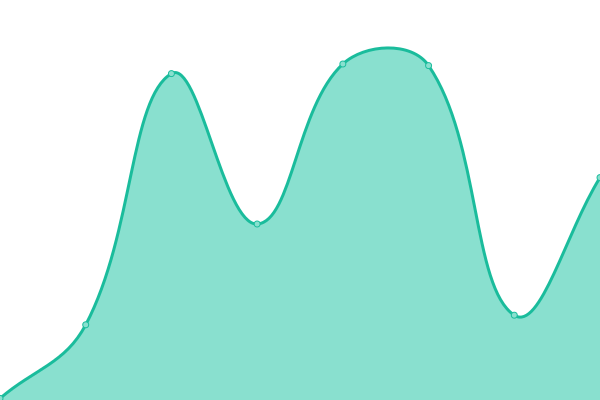
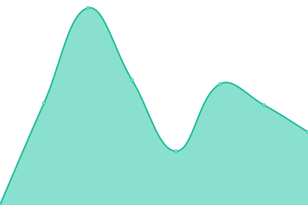
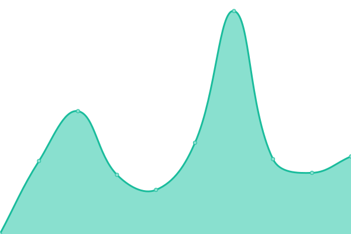
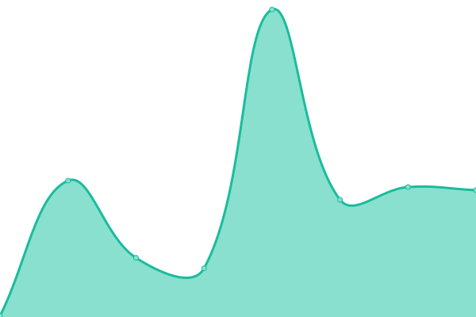

# [📈 Live Status](https://PuraVida-Technologies.github.io/pura-vida-status): <!--live status--> **🟩 All systems operational**

This repository contains the open-source uptime monitor and status page for [PuraVida-Technologies](https://PuraVida-Technologies.github.io/pura-vida-status), powered by [Upptime](https://github.com/upptime/upptime).

With [Upptime](https://upptime.js.org), you can get your own unlimited and free uptime monitor and status page, powered entirely by a GitHub repository. We use [Issues](https://github.com/PuraVida-Technologies/pura-vida-status/issues) as incident reports, [Actions](https://github.com/PuraVida-Technologies/pura-vida-status/actions) as uptime monitors, and [Pages](https://PuraVida-Technologies.github.io/pura-vida-status) for the status page.

<!--start: status pages-->
<!-- This summary is generated by Upptime (https://github.com/upptime/upptime) -->
<!-- Do not edit this manually, your changes will be overwritten -->
<!-- prettier-ignore -->
| URL | Status | History | Response Time | Uptime |
| --- | ------ | ------- | ------------- | ------ |
|  [Pura Vida Website](https://puravidabitcoin.io/) | 🟩 Up | [pura-vida-website.yml](https://github.com/PuraVida-Technologies/pura-vida-status/commits/HEAD/history/pura-vida-website.yml) | 

 85ms
     
 | 

<a href="https://status.puravidabitcoin.io/history/pura-vida-website">100.00%</a>
    

|  [Pura Vida Pay](https://pay.puravidabitcoin.io/) | 🟩 Up | [pura-vida-pay.yml](https://github.com/PuraVida-Technologies/pura-vida-status/commits/HEAD/history/pura-vida-pay.yml) | 

 625ms
     
 | 

<a href="https://status.puravidabitcoin.io/history/pura-vida-pay">100.00%</a>
    

|  [Pura Vida Merchants](https://merchants.puravidabitcoin.io/) | 🟩 Up | [pura-vida-merchants.yml](https://github.com/PuraVida-Technologies/pura-vida-status/commits/HEAD/history/pura-vida-merchants.yml) | 

 357ms
     
 | 

<a href="https://status.puravidabitcoin.io/history/pura-vida-merchants">100.00%</a>
    

|  [Pura Vida Market](https://market.puravidabitcoin.io/) | 🟩 Up | [pura-vida-market.yml](https://github.com/PuraVida-Technologies/pura-vida-status/commits/HEAD/history/pura-vida-market.yml) | 

 138ms
     
 | 

<a href="https://status.puravidabitcoin.io/history/pura-vida-market">100.00%</a>
    

|  [Pura Vida API](https://api.puravidabitcoin.io/graphql) | 🟩 Up | [pura-vida-api.yml](https://github.com/PuraVida-Technologies/pura-vida-status/commits/HEAD/history/pura-vida-api.yml) | 

 300ms
     
 | 

<a href="https://status.puravidabitcoin.io/history/pura-vida-api">100.00%</a>
    

|  [Pura Vida ATMs](https://admin.atm.puravidabitcoin.io/login) | 🟩 Up | [pura-vida-at-ms.yml](https://github.com/PuraVida-Technologies/pura-vida-status/commits/HEAD/history/pura-vida-at-ms.yml) | 

 216ms
     
 | 

<a href="https://status.puravidabitcoin.io/history/pura-vida-at-ms">100.00%</a>
    

|  [Service Monitoring System](https://status.detail.puravidabitcoin.io/) | 🟩 Up | [service-monitoring-system.yml](https://github.com/PuraVida-Technologies/pura-vida-status/commits/HEAD/history/service-monitoring-system.yml) | 

 186ms
     
 | 

<a href="https://status.puravidabitcoin.io/history/service-monitoring-system">100.00%</a>
    

<!--end: status pages-->

[**Visit our status website →**](https://PuraVida-Technologies.github.io/pura-vida-status)

## 📄 License

- Powered by: [Upptime](https://github.com/upptime/upptime)
- Code: [MIT](./LICENSE) © [Anand Chowdhary](https://anandchowdhary.com), supported by [Pabio](https://pabio.com)
- Data in the `./history` directory: [Open Database License](https://opendatacommons.org/licenses/odbl/1-0/)
